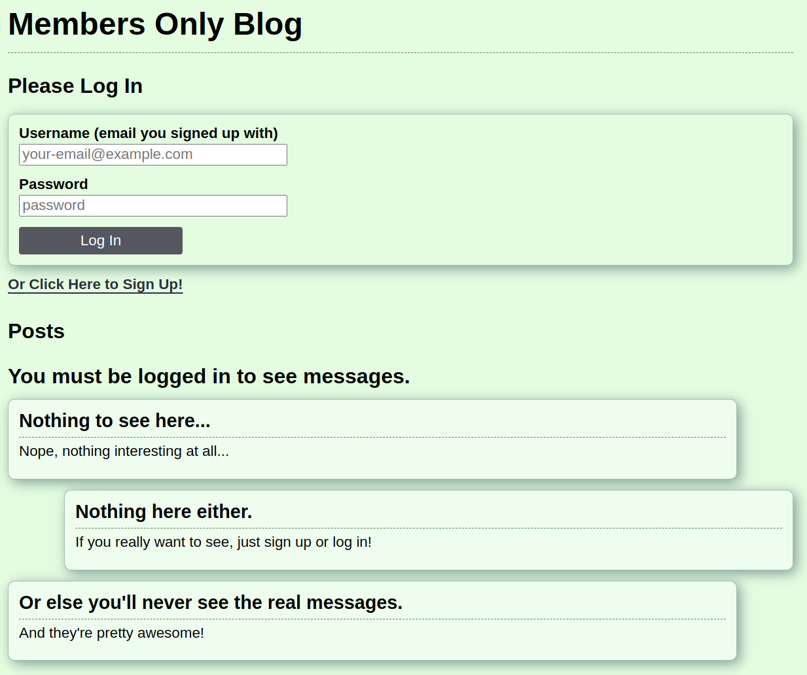

# Members Only Clubhouse

An exclusive Express and PostgreSQL-based application where users can post anonymous messages. Members get the full scoop—seeing the author and timestamp on posts—while non-members see only the message content. The app demonstrates user authentication, role-based content display, and secure session management, and is deployed on Railway.

---

## Table of Contents

-   [Features](#features)
-   [Live Demo](#live-demo)
-   [Technologies Used](#technologies-used)
-   [Usage](#usage)
-   [Future Improvements](#future-improvements)
-   [Contributing](#contributing)
-   [License](#license)

---

## Features

-   **User Authentication & Security:**

    -   Sign-up form with input validation using `express-validator` and secure password hashing with `bcryptjs`.
    -   Automatic login after successful sign-up using Passport.js.
    -   Session management via `express-session` and `connect-pg-simple`.

-   **Membership & Role-Based Access:**

    -   Users sign up without membership status by default.
    -   A secret passcode page lets users "join the club" and update their membership status.
    -   Only members can view the author and timestamp of posts; non-members see only the message content.
    -   Admin users (granted through a secret passcode) can delete messages.

-   **Message Posting:**

    -   Logged-in users can create new messages with a title, timestamp, and text content.
    -   Posts are linked to user accounts, allowing for personalized content display.

-   **Database Organization & Error Handling:**

    -   Database queries are organized into classes for clean, modular code.
    -   Custom asynchronous error-handling middleware ensures smooth and consistent error management.

-   **Deployment on Railway:**
    -   Deployed on Railway, showcasing backend development, secure database connectivity, and environment variable management with `dotenv`.

---

## Live Demo

Check out the live demo: [Members Only Clubhouse](https://members-only-production-c442.up.railway.app/)

---

## Technologies Used

-   **Node.js & Express:** For building the server and API endpoints.
-   **PostgreSQL:** Database engine for storing users and messages.
-   **Passport.js:** For authentication and automatic login.
-   **express-validator:** For validating and sanitizing user input.
-   **bcryptjs:** For securely hashing passwords.
-   **express-session & connect-pg-simple:** For session management.
-   **EJS:** Embedded JavaScript templating for dynamic HTML.
-   **dotenv:** For environment variable management.
-   **Railway:** Deployment platform.
-   **CSS:** Styling with a focus on user-friendly design.

---

## Usage

-   **Home Page:**

    -   View a list of messages.
    -   Logged-in users see full post details (author and timestamp) if they are members or admins.
    -   Non-members see only the message content, preserving anonymity.

-   **User Management:**

    -   **Sign-Up:** Create a new account with full names, email (as username), and password (with confirm password validation).
    -   **Login:** Secure login using Passport.js.
    -   **Membership:** Use a secret passcode page to update membership status.
    -   **Admin:** Admin users have an extra control to delete messages.

-   **Message Posting:**

    -   Create a new message via a dedicated form.
    -   Messages are associated with the logged-in user and displayed on the home page.

-   **Automatic Login:**
    -   Users are logged in automatically after signing up, streamlining the experience.

---

## Future Improvements

-   **Enhanced UI/UX:**

    -   Improve styling and responsiveness of the front end.
    -   Add more dynamic interactions and feedback for user actions.

-   **Advanced Role Management:**

    -   Implement more granular role-based permissions.
    -   Add additional user settings and profile customization.

-   **Rich Text Editing:**

    -   Introduce a rich text editor for message creation.
    -   Enable file uploads or image attachments for posts.

---

## Contributing

Contributions, issues, and feature requests are welcome! To contribute:

1. Fork the repository.
2. Create a feature branch: `git checkout -b feature/your-feature`.
3. Commit your changes: `git commit -m 'Add a cool feature'`.
4. Push the branch: `git push origin feature/your-feature`.
5. Open a Pull Request.

---

## License

This project is licensed under the [MIT License](/LICENSE). Feel free to use, modify, and distribute the project as you see fit.
